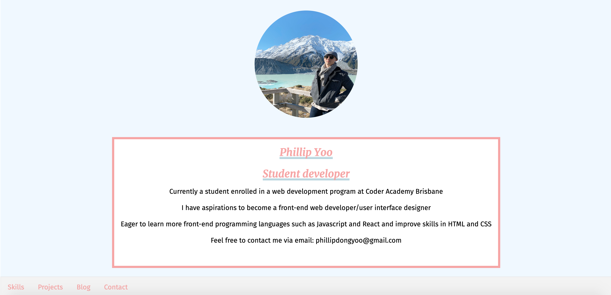
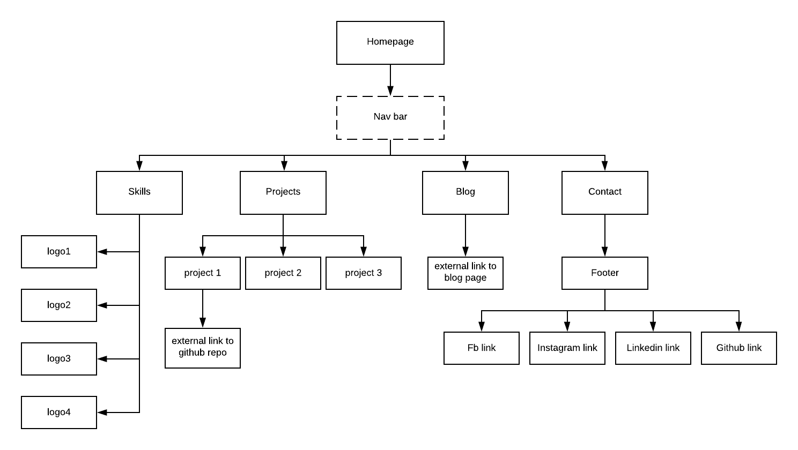

# My portfolio

 #### https://phillipyoo.github.io/myportfolio/ 
 #### https://github.com/phillipyoo/myportfolio



### Setup
1. Clone or fork this repository
2. Install required independacies from your terminal by running `npm install`.

        npm install
3. Open ``index.html`` locally in any browser
4. Styles, colors and variables may be modified in ``portfolio.scss`` 

## Purpose and scope
<p>The aim of this portfolio is to showcase skills that were used in the making of the website to potential recruiters or tech companies who are interested in the front-end dev work I've done.
<p>Main langauges used were HTML, CSS and a little bit of Javascript. 

## Sitemap



## Main Components 

1. Navigation bar 
    <p> The bar visibily outlines the sections that are available for users to click onto.
2. Smooth scroll-down
    <p> To improve user expererience a smooth scroll-down was implemented.
```
    html {
    scroll-behavior: 
    smooth;
    }
```
3. Slide animation box
    <p> Created a sliding overlay effect to each project image when pointer is hovered on a particular image. The overlay includes some text descriptions including the name of the project and the type of work achieved.
 
4. Contact form
    <p> Contact form takes name, email and enquiries of inquirer or user.

## Color scheme

| Colour      | Code |
| ----------- | ----------- |
| Alice Blue  | #F0F8FF     |
| Pale Red    | #f5a5a5     |
| Whisper     | #e7e7e7     |
| Whtie smoke | #f3f3f3     |


    


